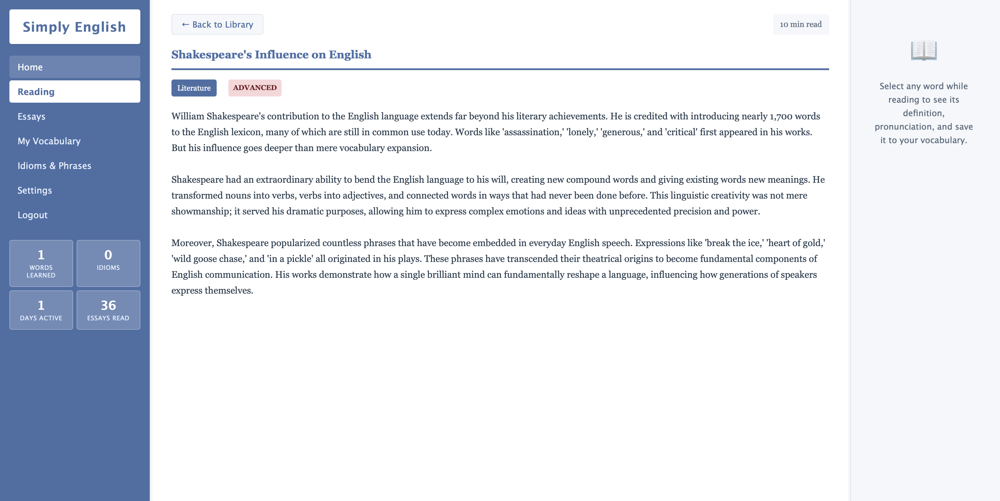

# Notepad with Supabase Backend



A simple, clean web-based notepad application built with Node.js, TypeScript, Express, and Supabase as the backend database.

## Features

- Create, read, update, and delete notes
- Auto-save functionality (every 30 seconds)
- Clean and responsive UI
- Real-time updates
- RESTful API
- Docker support

## Prerequisites

- Node.js 20 or higher
- A Supabase account and project
- Docker (optional, for containerized deployment)

## Setup

### 1. Supabase Setup

1. Create a new project at [supabase.com](https://supabase.com)
2. Go to the SQL Editor in your Supabase dashboard
3. Run the SQL schema from `supabase-schema.sql` to create the notes table
4. Get your project URL and anon key from Settings > API

### 2. Local Development

1. Clone or download this repository
2. Install dependencies:
   ```bash
   npm install
   ```

3. Create a `.env` file in the root directory:
   ```bash
   cp .env.example .env
   ```

4. Edit `.env` and add your Supabase credentials:
   ```
   PORT=3000
   SUPABASE_URL=your_supabase_project_url
   SUPABASE_ANON_KEY=your_supabase_anon_key
   ```

5. Run in development mode:
   ```bash
   npm run dev
   ```

6. Build for production:
   ```bash
   npm run build
   npm start
   ```

7. Open your browser and navigate to `http://localhost:3000`

### 3. Docker Deployment

1. Make sure you have a `.env` file with your Supabase credentials

2. Build and run with Docker Compose:
   ```bash
   docker-compose up -d
   ```

3. Or build and run with Docker directly:
   ```bash
   docker build -t notepad-supabase .
   docker run -p 3000:3000 --env-file .env notepad-supabase
   ```

4. Access the application at `http://localhost:3000`

## API Endpoints

- `GET /api/health` - Health check endpoint
- `GET /api/notes` - Get all notes
- `GET /api/notes/:id` - Get a specific note
- `POST /api/notes` - Create a new note
- `PUT /api/notes/:id` - Update a note
- `DELETE /api/notes/:id` - Delete a note

## Project Structure

```
notepad-supabase/
├── src/
│   ├── config.ts           # Configuration and environment variables
│   ├── supabase.ts         # Supabase client initialization
│   ├── server.ts           # Express server setup
│   └── routes/
│       └── notes.ts        # Notes API routes
├── public/
│   ├── index.html          # Frontend HTML
│   ├── styles.css          # Frontend styles
│   └── app.js              # Frontend JavaScript
├── Dockerfile              # Docker configuration
├── docker-compose.yml      # Docker Compose configuration
├── supabase-schema.sql     # Database schema
├── package.json            # Node.js dependencies
└── tsconfig.json           # TypeScript configuration
```

## Technologies Used

- **Backend**: Node.js, Express, TypeScript
- **Database**: Supabase (PostgreSQL)
- **Frontend**: HTML, CSS, Vanilla JavaScript
- **Containerization**: Docker

## Development

To run in development mode with hot reload:

```bash
npm run dev
```

## License

MIT
